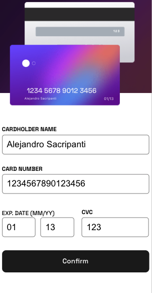

# Frontend Mentor - Interactive card details form solution

This is a solution to the [Interactive card details form challenge on Frontend Mentor](https://www.frontendmentor.io/challenges/interactive-card-details-form-XpS8cKZDWw). Frontend Mentor challenges help you improve your coding skills by building realistic projects. 

## Table of contents

- [Frontend Mentor - Interactive card details form solution](#frontend-mentor---interactive-card-details-form-solution)
  - [Table of contents](#table-of-contents)
  - [Overview](#overview)
    - [The challenge](#the-challenge)
    - [Screenshot](#screenshot)
    - [Built with](#built-with)
    - [Running the app](#running-the-app)
    - [What I learned](#what-i-learned)
  - [Author](#author)

**Note: Delete this note and update the table of contents based on what sections you keep.**

## Overview

### The challenge

Users should be able to:

- Fill in the form and see the card details update in real-time
- Receive error messages when the form is submitted if:
  - Any input field is empty
  - The card number, expiry date, or CVC fields are in the wrong format
- View the optimal layout depending on their device's screen size
- See hover, active, and focus states for interactive elements on the page

### Screenshot

### Built with

- Semantic HTML5 markup
- CSS custom properties
- Flexbox
- CSS Grid
- [React + Vite](https://reactjs.org/) - JS library

### Running the app 

- Clone the repository 'git clone https://github.com/asacripanti/interactiveCardForm.git'
- Navigate to the project directory
- install all dependencies 'npm install'
- Start the server 'npm start'
- Copy and paste the url for the server into your browser. 

### What I learned

I created this app with react, I really wanted to focus on the flexibilty that conditional rendering with state provided. With this approach, it made applying custom error messages to the input fields when an error was triggered much easier. One of my favorite things from working on this project was creating the little card images that updated the info in real time as the user fills out the form. Using the onChange property on the input fields which then invoked the callback function to update the state of the form data, which is passed into the card images... that's one way to say I felt like a web wizard passing data around while working on this project. 

## Author

- Website - [Alejandro Sacripanti](https://asacripanti.github.io/portfolio/)
- Frontend Mentor - [@asacripanti](https://www.frontendmentor.io/profile/asacripanti)
- linkedIn - 
- Github - https://github.com/asacripanti/

